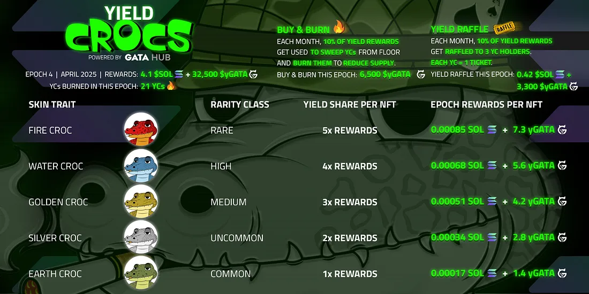

# On Chain GATA DAO

## Access DAOs and stake your NFTS

• [GATAc DAO](https://daodao.zone/dao/stars19fz2t65uqlhrrznpllmmu7nzsvv3v2p4wruypthy7yjpsz5rltvqp6gjsk): Holders of [Colonial Cats](https://www.stargaze.zone/m/stars1yw4xvtc43me9scqfr2jr2gzvcxd3a9y4eq7gaukreugw2yd2f8tssqyvcm/tokens) can stake here to be eligible for monthly reward share from the GATA HUB validators.  \
\
• [GATAv DAO](https://daodao.zone/dao/stars1t5kx0emmfep57u8g6dupd6zs6z58v39zky852gm58lj3nwpuexuq0krw0c):  Holders of [Voyager Cats](https://www.stargaze.zone/m/voyagercats/tokens) can stake here to be eligible for monthly reward share from the GATA HUB validators.\
\
• [GATA DAO](https://daodao.zone/dao/stars1v9yezwju74fyjkjrzh7j90y5ga9xg2ulzft0z69nmtlh0hayvhuqnpsenf): The combined vote of the Above two DAOs will help make the division in the main DAO, No one is directly a member of the GATA DAO but indirectly through the secondary DAOs.  \
\
To better understand the structure check the following flow diagram.&#x20;

## GATA DAO Decision making Flow

## DAO FAQs

Who can propose? 

Any DAO member can start a governance proposal, proposal deposit is 1000 $STARS which will be refunded after the voting time.  &#x20;

Is it necessary to stake, to be eligible for the Epoch rewards?

Yes.\
\
With the staking functionality finally in place, GATA is switching the distribution of GATA epoch rewards to active stakers\
\
• To continue to be eligible for monthly GATA epoch rewards, you need to stake your GATA in the DAO of the respective collection \
\
• From epoch 20 (1st April 2024) onward, only holders that staked their GATA will receive epoch rewards on distribution day

How /where to stake NFTs?

Holders of [Colonial Cats](https://www.stargaze.zone/m/stars1yw4xvtc43me9scqfr2jr2gzvcxd3a9y4eq7gaukreugw2yd2f8tssqyvcm/tokens) can stake [here ](https://daodao.zone/dao/stars19fz2t65uqlhrrznpllmmu7nzsvv3v2p4wruypthy7yjpsz5rltvqp6gjsk)to be eligible for monthly reward share from the GATA HUB validators.  \
\
&#x20;Holders of [Voyager Cats](https://www.stargaze.zone/m/voyagercats/tokens) can stake [here ](https://daodao.zone/dao/stars1t5kx0emmfep57u8g6dupd6zs6z58v39zky852gm58lj3nwpuexuq0krw0c)to be eligible for monthly reward share from the GATA HUB validators.&#x20;

* &#x20;Log[^1] in with the account you hold NFTs in.&#x20;

\

* Chose your wallet and connect&#x20;

.png>)

* mange your stake

&#x20;.png>)

Why 3 DAOs? Why not go for one DAO and a few SubDAOs?

DAODAO doesn't support governance with/by staking of multiple NFT collections in one DAO yet. Because of this, we decided to go for separate DAOs for each collection. \
\
• The collection DAO's are the sole members of the main GATA DAO.\
\
• Therefore, holders of GATAc & GATAv vote directly on governance proposals of the Main DAO through their own DAOs & the result of each collection DAO will be passed as vote to main DAO, automatically.\

What are the DAO settings ( Voting time, Unstaking time, Quorum and more)?

• 3 days voting time&#x20;

• 5 days unstaking time&#x20;

• 10% quorum&#x20;

• 1000 STARS for proposal creation + refund in case of failed vote

How to vote?

* To be eligible for the vote, you need to have the VP before the proposal goes live.&#x20;
* If someone have the VP to vote on the proposal.&#x20;
* Voting time is 3 dyas.&#x20;
* Vote can be changed anytime during the voting time.
* All live proposal show up on the proposal tab of DAO.&#x20;

Open the proposal and vote as you deem right \

submit the transaction, approve in your wallet, you need some $STARS for gas.&#x20;

[^1]: 
