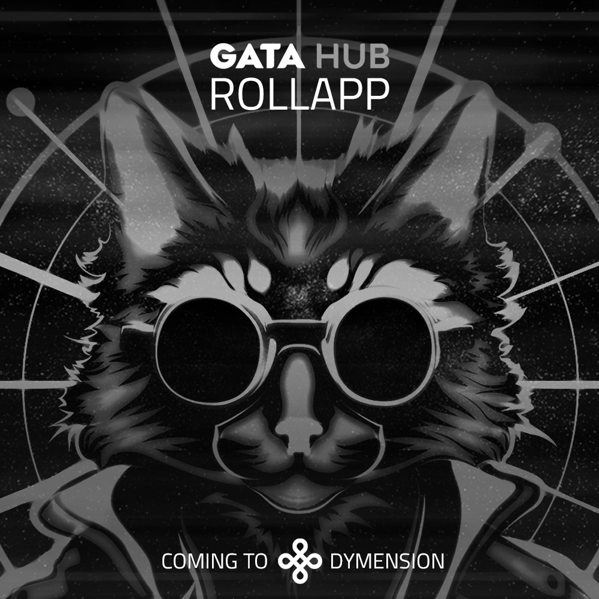

# RollApp

GATA HUB redefines yield farming and sustainable value creation for the EVM community and beyond by building a dynamic yield hub in form of a RollApp. A robust suite of dApps empowers users and projects alike to create passive income streams via staking, pooling and perpetuals for FTs and NFTs. This dynamic yield hub provides investors, creators and NFT enthusiasts with opportunities to create added value for themselves, their stakeholders and peers.

More details soon.

<figure><figcaption></figcaption></figure>
