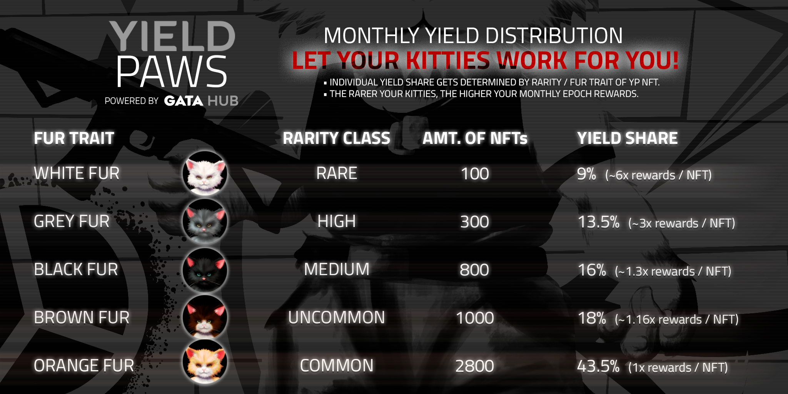

# Yield Paws

## About the collection

**Collection name:** [Yield Paws](https://www.stargaze.zone/l/yieldpaws) \
**Network:** [Stargaze Zone](https://www.stargaze.zone/l/yieldpaws)\
**Collection Type:** Standard Collection \
**Public Mint Price:** 777 $STARS (50 mints/wallet)\
**WL Mint Price:** 725 $STARS (10 mints/wallet)\
**Collection Size**: 5000\
**Royalties:** 1%

**WL mint:** April 4th 2024, 7 pm UTC\
**Public mint:** April 5th 2024, 7 pm UTC

## Utility of Yield Paws

Each month, this new Yield series collection by GATA HUB will provide you with&#x20;

• Epoch Rewards (70% of yield gets distributed to all YP holders in $STARS)

• [Buy & Burn](yield-paws-faqs.md#what-is-the-buy-and-burn-program-and-how-does-it-work) program (5% of yield gets used to sweep floor & to reduce supply continuously)&#x20;

• [Yield Raffle](yield-paws-faqs.md#what-is-the-yield-raffle-and-how-does-it-work) (5% of yield gets raffled with 3 random YPs winning; each YP = 1 ticket)

## Monthly Yield Distribution - Reward Allocation by Fur Trait

Yield revenue gets distributed to holders of Yield Paws on a monthly basis. Each NFT gets a basic income reward, but on top of that, the individual share of yield is based on the fur trait - the rarer your kitties, the higher your rewards:&#x20;

<figure><figcaption></figcaption></figure>

## Concept of Yield Paws - Funding, Model & Distribution

<figure><figcaption></figcaption></figure>
