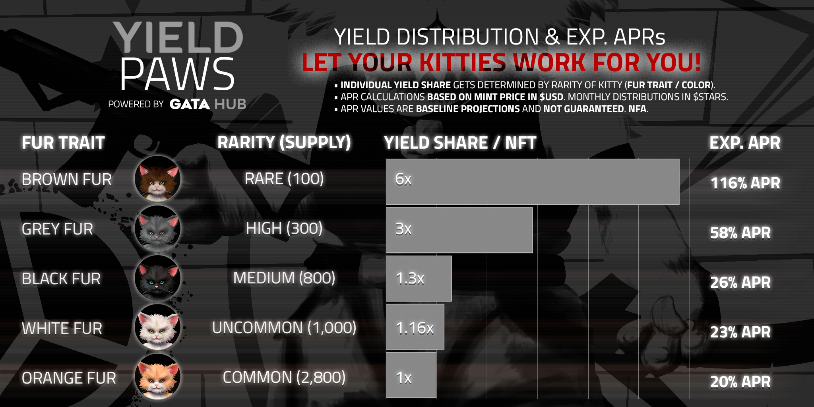
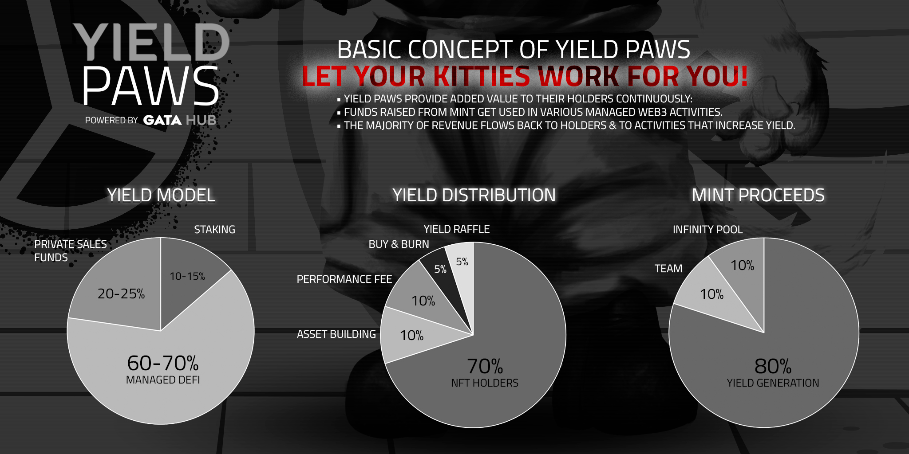

# Yield Paws


Trade floor NFTs in the infinity swap [pool](https://www.stargaze.zone/infinity-swap/pool/stars1qcesxkn4jcfg2fyffwqhpv02ufrg0szsae6ztzn6jjvgclpgsfws7h4vee/overview)


## About the collection

**Collection name:** [Yield Paws](https://www.stargaze.zone/l/yieldpaws) \
**Network:** [Stargaze Zone](https://www.stargaze.zone/l/yieldpaws)\
**Collection Type:** Standard Collection \
**Public Mint Price:** 777 $STARS (50 mints/wallet)\
**WL Mint Price:** 725 $STARS (10 mints/wallet)\
**Collection Size**: 5000\
**Royalties:** 1%

**WL mint:** April 4th 2024, 7 pm UTC\
**Public mint:** April 5th 2024, 7 pm UTC

## Utility of Yield Paws

Each month, this new Yield series collection by GATA HUB will provide you with&#x20;

• Epoch Rewards (70% of yield revenue gets distributed to YP holders in $STARS)

• [Buy & Burn](yield-paws-faqs.md#what-is-the-buy-and-burn-program-and-how-does-it-work) program (5% of yield gets used to sweep floor & to reduce supply continuously)&#x20;

• [Yield Raffle](yield-paws-faqs.md#what-is-the-yield-raffle-and-how-does-it-work) (5% of yield gets raffled with 3 random YPs winning; each YP = 1 ticket)

## Monthly Yield Revenue & Trait-Based Yield Distribution&#x20;

Yield Paws holders benefit from monthly distributions of revenue gained from the [yield model activities](./#concept-of-yield-paws-funding-model-and-distribution), the so called **epoch rewards**. These are **$STARS** which get distributed directly to the wallets of holders. You just need to hold your kitties tightly: **no staking is needed** to be eligible for these monthly epoch rewards.

The **individual yield share per NFT** gets determined by the **fur colors** of your kitties. There are **5 different colors** with **5 different yield share values**. The rarer your kitties, the higher your rewards:&#x20;

<figure><figcaption>
Yield Distribution &#x26; APR Projections
</figcaption></figure>

On APR Projections:

• APRs above are **baseline projections** at launch and **based on mint price in $USD**. From mint onwards, this **reference point** will serve for **regular reports** on YP's APR performance in the future.

• Regardless of APR calculations based on $USD, monthly epoch rewards get **distributed in $STARS**

## Concept of Yield Paws - Funding, Model & Distribution

<figure><figcaption></figcaption></figure>
