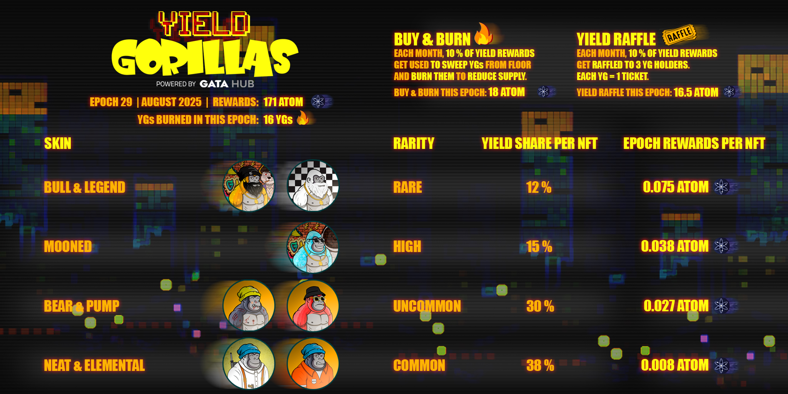

# YP Reward Distribution


* **1.936 M $STARS** / **18193 USD** Yield &#x20;
* **1.559 M  $Stars** distributed to holders
* **9 Epoch** distributed \
  &#xNAN;_( Last updated January 1, 2025)_&#x20;


## YP Epoch 10

* Epoch Distributed on 1st February 2025
* 301K Stars Yielded&#x20;
* 240K Stars Distribution to YP holders based on skins&#x20;
* `26` YPs **burned** using \~30.5K Stars [(See burn table for more details)](yps-assets.md#burned-yps)
* 3 x Raffle rewards worth 10K $Stars each to&#x20;

| Source        | STARS Yield                                                                                                          | USD Price (0.0041) |
| ------------- | -------------------------------------------------------------------------------------------------------------------- | ------------------ |
| Staked Assets | 4K STARS                                                                                                             | 16.4 USD           |
| yGATA         | [297.5K STARS](https://www.mintscan.io/stargaze/tx/466F9D9926F51EC6CD5BB10074F999BDFE463E67B2AC2A6D2CF571EEFA50BEFB) | 1200 USD           |
| **Total**     | 301000 STARS                                                                                                         | **1220 USD**       |

## YP Epoch 9

* Epoch Distributed on 1st January 2025
* 299K Stars Yielded&#x20;
* [240K ](https://www.mintscan.io/stargaze/tx/E35FE7E1089C995199A5E0E1F97086C5539BFD7642045FC870E7446086824F9C?height=16966781)Stars Distribution to YP holders based on skins&#x20;
* [`31`](https://www.mintscan.io/stargaze/tx/AC70CFCB36D0166393115F26E0DEADB8C93FF75F9231DBDC9A3CB0517BD8A2F7?height=16966797) YPs **burned** using \~29.5K Stars [(See burn table for more details)](yps-assets.md#burned-yps)
* 3 x Raffle rewards worth 9900 $Stars each to [**YP #286**](https://www.mintscan.io/stargaze/tx/1190A1F203F80DCE4A48AD6883C18316568B135964F63410932585D7C3D02993), [**YP #1940**](https://www.mintscan.io/stargaze/tx/BC5308E41729CD1C5661F7B56A6577C2D9B302BC39609637349246077C5EC44D) and [**YP #1247**](https://www.mintscan.io/stargaze/tx/7D1BC695476BA4152CC3DD1F14D023B30882A981023FECDF3CBDB85251166BC5)

| Source        | STARS Yield                                                                                                                          | USD Price (0.0055) |
| ------------- | ------------------------------------------------------------------------------------------------------------------------------------ | ------------------ |
| Staked Assets | [5.9K STARS](https://www.mintscan.io/stargaze/tx/E33758D8CC7C3B59FD03513587CFC35C3A940999556592C474B79A660BB1BBD6)                   | 32 USD             |
| yGATA         | [293.5K STARS](https://www.mintscan.io/stargaze/tx/F64E2392B0A9B3DF78E2AA8798CFD9BB76FAC7123454CB0A41CCFC67DB3E2963?height=16966737) | 1670 USD           |
| **Total**     | 299,000 STARS                                                                                                                        | **1702 USD**       |

{% embed url="https://github.com/ABCharlieEth/snapshots/blob/main/Yield%20Paws/YP%20epoch%209" %}

<figure><figcaption>
YP epoch 9
</figcaption></figure>

## YP Epoch 8

* Epoch Distributed on 1st December 2024
* 165K Stars Yielded&#x20;
* [132K](https://www.mintscan.io/stargaze/tx/5372474C9AD43A31118B53FEABA67549AB420C55D33E8D436E37F75021881CE6)Stars Distribution to YP holders based on skins&#x20;
* [11 YPs](https://www.mintscan.io/stargaze/txs/F1732636208355B8BD24AD153DAC011EC88274381F740D5A0AAAAFFD0D2031DE) **burned** using \~16.5K Stars [(See burn table for more details)](yps-assets.md#burned-yps)
* 3 x Raffle rewards worth 5500 $Stars each to [**YP #3191**](https://www.mintscan.io/stargaze/tx/F7B6562D6D1483D64D0BF1EF6B8D447957FE470E041535E99BEF3EA994729759), [**YP #1668**](https://www.mintscan.io/stargaze/tx/0FFEF8756ACA12D1CF4F3C9886A8394AF92CFF05435592C548D0C3B7203CEC0C) and [**YP #2775** ](https://www.mintscan.io/stargaze/tx/E14728AB613075397BCCE9D69F60F4DCFC5F3BBBD280FEA26F9359DB6B2E45FC)

| Source        | STARS Yield                                                                                                         | USD Price (0.008) |
| ------------- | ------------------------------------------------------------------------------------------------------------------- | ----------------- |
| Staked Assets | [5.2K STARS](https://www.mintscan.io/stargaze/tx/E33758D8CC7C3B59FD03513587CFC35C3A940999556592C474B79A660BB1BBD6)  | 42 USD            |
| yGATA         | [159.8K STARS](https://www.mintscan.io/osmosis/tx/0512D3E7A8D7B492A2B14CE7B6B34A3E18F6394A8DE059B32559F123CF43FE32) | 1280 USD          |
| **Total**     | 165,000 STARS                                                                                                       | **1322 USD**      |

{% embed url="https://github.com/GATA-HUB/snapshots/blob/main/Yield%20Paws/YP%20epoch%208" %}

<figure><figcaption></figcaption></figure>

## YP Epoch 7

* Epoch Distributed on November  2024
* 271K Stars Yielded&#x20;
* 189.7KStars Distribution to YP holders based on skins&#x20;
* 27.1K Stars sent to team
* 27.1K Stars further added to LP (\~200 USD) &#x20;
* [9](https://www.mintscan.io/stargaze/tx/59E9293B8F4244619177E4D30A67DC911F341D5B5041685D7AD84FBAEBAEB721?height=16099649) YPs **burned** using \~13.6K Stars [(See burn table for more details)](yps-assets.md#burned-yps)
* 3 x Raffle rewards worth 4500 $Stars each to [**YP #2552**](https://www.mintscan.io/stargaze/tx/72B9CF44986F21D41710E28F166227B5F6B65891EBA390A8C4697A2F43EAB8D2), [**YP #4194**](https://www.mintscan.io/stargaze/tx/C69E5A358251B4147CA761F5D6282D103F13EFF14616B08B3878882F327C53F2)and [**YP #872**](https://www.mintscan.io/stargaze/tx/81272FC84CF1B909CDBA65AA377A43F3FCEC9D340276BE4302F218FD24574DB9)

{% embed url="https://github.com/GATA-HUB/snapshots/blob/main/Yield%20Paws/YP%20Epoch%207" %}

| Source         | Stars yield                                                                                                        | USD Price (0.006) |
| -------------- | ------------------------------------------------------------------------------------------------------------------ | ----------------- |
| Staked assets  | [4583 Stars](https://www.mintscan.io/stargaze/tx/69DBD552E8119B9AB40354348629EF2E23EADFFEF345D937D3C96ABD264BBBDF) | 28 USD            |
| Managed Assets | 266417 Stars                                                                                                       | 1600 USD          |
| **Total**      | **271000 Stars**                                                                                                   | **1628 USD**      |

<figure><figcaption></figcaption></figure>

## YP Epoch 6

* Epoch Distributed on October  2024
* 255K Stars Yielded&#x20;
* [178.5K](https://www.mintscan.io/stargaze/tx/11773BEAEE0F2FA7B8375A3A319E8F5A420D3FAE7BDBB6572BEE337FFDB0D51F)Stars Distribution to YP holders based on skins&#x20;
* 25.5K Stars sent to team
* 25.5K Stars further added to LP (\~200 USD) &#x20;
* [10](https://www.mintscan.io/stargaze/tx/C56A8BFF65C69733C85036929DBB80670545553F4AEAF82B91B5CEB4E1A0F88D?height=15640504) YPs **burned** using \~13.4K Stars [(See burn table for more details)](yps-assets.md#burned-yps)
* 3 x Raffle rewards worth 4300 $Stars each to [**YP #0909**](https://www.mintscan.io/stargaze/tx/7B30A49E1B59397E2577DD80ED0ED83393435D2BD1DA909FD11A9143597A924C?height=15700921), [**YP #0472**](https://www.mintscan.io/stargaze/tx/98250739755E44096CA4787D454077B3005E3E0FB009BA57ED4A50C3CAFE1A93?height=15700942) and [**YP #2877**](https://www.mintscan.io/stargaze/tx/D72DAD6821B981A759E815C9D2D7A19B787E6779146C88179DEFB5866514713B?height=15700956)

{% embed url="https://github.com/GATA-HUB/snapshots/blob/main/Yield%20Paws/YP%20epoch%206" %}

<table><thead><tr><th>Source</th><th width="236">Stars Yield</th><th>USD Price (0.008/Stars)</th></tr></thead><tbody><tr><td>Staked Assets</td><td><a href="https://www.mintscan.io/stargaze/tx/437F92FE0F62E34C1ACCAC4C8EF9873C81FB3FCB5C3168B3303CE6F07FE2FD15">4194 Stars</a></td><td>35 USD</td></tr><tr><td>Managed Assets</td><td>251000 Stars</td><td>2000 USD</td></tr><tr><td>Private investment</td><td>-- Stars</td><td>-- USD</td></tr><tr><td><strong>Total</strong></td><td><strong>255194 Stars</strong></td><td><strong>2035 USD</strong></td></tr></tbody></table>

<figure><figcaption></figcaption></figure>

## YP Epoch 5

* Epoch Distributed on September  2024
* 250.5K Stars Yielded&#x20;
* [175K](https://www.mintscan.io/stargaze/tx/18F0D251787DC9E2D695AA6092328F5B98DFE86DB55AB7275F52783F47DAC1ED?height=15205123)Stars Distribution to YP holders based on skins&#x20;
* 25K Stars sent to team
* 25K Stars further added to LP (\~200 USD) &#x20;
* &#x20;[8](https://www.mintscan.io/stargaze/tx/1DCCBE40899D85F72DD1804ECA05288F2B9D357CCF211E1AC990010E747EB848?height=15205202) YPs **burned** using \~12K Stars [(See burn table for more details)](yps-assets.md#burned-yps)
* 3 x Raffle rewards worth 4200 $Stars each to [**YP# 0054**](https://www.mintscan.io/stargaze/tx/728FFCE4CEE5D935D84963D3DA3A0DB72673BF4B89F53457210E3A19F8E8FD78)**,** [**YP# 4665**](https://www.mintscan.io/stargaze/tx/8A5F9E46D8C9973290773302C1694E77721AA55CEF9143A5979964DF87D18B7B) **and** [**YP#3934**](https://www.mintscan.io/stargaze/tx/1BB66B0EA1C31CD677D4D7D76A0BDA47C14D2124FF06713E344CEC06590D7255)

{% embed url="https://github.com/GATA-HUB/snapshots/blob/main/Yield%20Paws/YP%20epoch%205" %}

| Source             | Stars Yield                                                                                                        | USD Price (0.008/Stars) |
| ------------------ | ------------------------------------------------------------------------------------------------------------------ | ----------------------- |
| Staked Assets      | [4423 Stars](https://www.mintscan.io/stargaze/tx/CADDEA8A0028CC80294560B406488BEE9E2EE42910DC5649D5F13D25AF6DB1C6) | 35 USD                  |
| Managed Assets     | 246000 Stars                                                                                                       | 1970 USD                |
| Private investment | -- Stars                                                                                                           | -- USD                  |
| **Total**          | **250423 Stars**                                                                                                   | **2005 USD**            |

<figure><figcaption>
YP Epoch 5
</figcaption></figure>

## YP Epoch 4

* Epoch Distributed on August  2024
* 241K Stars Yielded&#x20;
* [168.5K](https://www.mintscan.io/stargaze/tx/2C298A4756D5B8A7D22BCEDF5A265C2BD8AC67FF59AE62928AF3C58495C74EBB)Stars Distribution to YP holders based on skins&#x20;
* 24K Stars sent to team
* 24K Stars further added to LP (\~240 USD) &#x20;
* 15 YPs [burned](https://www.mintscan.io/stargaze/tx/BE4C7028025A1C83B361751E99B8B41E98D02F0E357F305534B9C17724684B39?height=14740280) using \~12K Stars&#x20;
* 3 x Raffle rewards worth 4000 $Stars each to [**YP #3854**](https://www.mintscan.io/stargaze/tx/23048DE72619BD42F95688627E290C8403633A27761F7892C75F76A42BF6EBD8)**,** [**YP #3189**](https://www.mintscan.io/stargaze/tx/5A62ACB1AD73F766A46669406DB093003083432CF1C354C9387482DA6EDE607E) **and** [**YP #1232**](https://www.mintscan.io/stargaze/tx/D367E7102C1354A1866BF39B20E2E477699CE1BDD566D71AA0E8D009FA5D13C0)

| Source             | Stars yield                                                                                                        | USD Price (0.01/Stars) |
| ------------------ | ------------------------------------------------------------------------------------------------------------------ | ---------------------- |
| Staked Assets      | [4166 Stars](https://www.mintscan.io/stargaze/tx/3066CEA4A7652A9DAE5E2FE6999ABA225320A9D1B97E6B526D2BC4268F2A2FBA) | 41 USD                 |
| Managed Assets     | 237000 Stars                                                                                                       | 2360 USD               |
| Private Investment | -- Stars                                                                                                           | -- USD                 |
| **Total**          | **241166**                                                                                                         | **2400 USD**           |

{% embed url="https://github.com/GATA-HUB/snapshots/blob/main/Yield%20Paws/YP%20epoch%204" %}

<figure><figcaption>
YP Epoch 4
</figcaption></figure>

## YP Epoch 3

* Epoch Distributed on July  2024
* 201K Stars Yielded&#x20;
* [140.5K](https://www.mintscan.io/stargaze/tx/2C298A4756D5B8A7D22BCEDF5A265C2BD8AC67FF59AE62928AF3C58495C74EBB) Stars Distribution to YP holders based on skins&#x20;
* 20K Stars sent to team
* 20K Stars further added to LP  (240 USD)
* 13 YPs [burned ](https://www.mintscan.io/stargaze/txs/9DCDECC6E6BEFDE9C7DD9834565C8126ABB7546B508E33C9B1E64D24558AB097)using \~10K Stars&#x20;
* 3 x Raffle rewards worth 3333 $Stars to  [YP# 1861](https://www.mintscan.io/stargaze/tx/3B470B3A1AB76DABC7375D919B78C7A03F5A6CD8A08D2F372E79930FB1478FC9)**,** [YP# 0097](https://www.mintscan.io/stargaze/tx/CDDE8B2E75F1BAB0D99D76742BDF22B485964E18C87D79D4EDE221D6BDE06362) and [YP#0003](https://www.mintscan.io/stargaze/tx/3389774B90DD1485BCDBA250BE49178E4DD3ED6920617E429EE39B5A6DCC4BF9)

| Source             | Stars Yield                                                                                                        | USD Price (0.012/Stars) |
| ------------------ | ------------------------------------------------------------------------------------------------------------------ | ----------------------- |
| Staked Assets      | [4123 Stars](https://www.mintscan.io/stargaze/tx/4AD1FD13557960EF2001DEF8852C12663A2AC7784DFE251A5CD0CAECD4A96ECF) | 50 USD                  |
| Managed Assets     | 197000 Stars                                                                                                       | 2365 USD                |
| Private investment | -- Stars                                                                                                           | -- USD                  |
| **Total**          | **201123 Stars**                                                                                                   | **2415 USD**            |

{% embed url="https://github.com/GATA-HUB/snapshots/blob/main/Yield%20Paws/YP%20epoch%203" %}

<figure><figcaption>
YP Epoch 3
</figcaption></figure>

## YP Epoch 2

* Epoch Distributed on 2nd June 2024
* 149.3K  Stars Yielded (\~2710 USD)
* [104.5K](https://www.mintscan.io/stargaze/tx/98F81B678F6E8691701FA132E572515D6E1B19377C05E375C7D42A6F5FC7A2C5) Distribution to YP holders based on skins&#x20;
* 14.9K Stars sent to team
* 14.9K Stars further added to LP ( \~270 USD)
* 12 YPs [burned](https://www.mintscan.io/stargaze/tx/1B87AF14528CC4CE9F083BC1EC30F8DAE352253FA23297BEB83F622099D1F89F) using \~7800 Stars&#x20;
* 3 x Raffle rewards worth 2500 $Stars to YPs [#2314](https://www.mintscan.io/stargaze/tx/B566CDE53E4C93CBECF5839F3FB0B68275A57542816761EBDC2004FB7D0C11FD?height=14005112), [#765 ](https://www.mintscan.io/stargaze/tx/2EEB469D229A2EACED1FD4482423F6C86830999C6C7C8DB53EC90E43E68F4655?height=14005121), [#3441](https://www.mintscan.io/stargaze/tx/8C26D01DB11E410E3378308D0B877FFE43424157AFB7CD9EED8896D457A8D538?height=14005133)

| Source              | Stars Yield  | USD Price (0.0183/Stars) |
| ------------------- | ------------ | ------------------------ |
| Staked Assets       | 4125 Stars   | 50 USD                   |
| Managed LP          | 145.2K Stars | 2650 USD                 |
| Private Investments | -- Stars     | 0 USD                    |
| **Total**           | **149.3K**   | **2710 USD**             |

{% embed url="https://github.com/GATA-HUB/snapshots/blob/main/Yield%20Paws/YP%20epoch%202" %}

<figure><figcaption></figcaption></figure>

## YP Epoch 1&#x20;

* Epoch distributed on 1st May 2024.&#x20;
* 105.2K Stars Yielded. (\~2200 USD)
* 3 x Raffle rewards 1750 $Stars Each to YP#[ 925 ](https://www.mintscan.io/stargaze/tx/FBC65B72AFF0062589A2202DDCB487333E8B05B19300715AF8B0400357C80C05?height=13460460), [2730](https://www.mintscan.io/stargaze/tx/842BC65D4836444D96CBD78FF09B8A2D27417EA9146FEEDF88E26D25F47CDCEA?height=13460465), [3911](https://www.mintscan.io/stargaze/tx/DC484BCCCED659CB95F4D8FE464A486024EC0697442AC15C9A9459C2CF70AE0A?height=13460471) .&#x20;
* 10 YPs Burned.&#x20;

{% embed url="https://github.com/GATA-HUB/snapshots/blob/main/Yield%20Paws/YP%20epoch%201" %}
Epoch 1 Snapshot


| Source              | Stars Yield                                                                                                                        | USD Price (0.019 USD/Stars) |
| ------------------- | ---------------------------------------------------------------------------------------------------------------------------------- | --------------------------- |
| Staked Assets       | [1980 Stars](https://www.mintscan.io/stargaze/tx/E1F84ADF1AD2FD7BFBD913554B66504CF58F66E13A4566D869E559BB04A0EE77?height=13404385) | 36 USD                      |
| Managed LP          | [102227 Stars](https://www.mintscan.io/osmosis/tx/DABC7807860E6069B551534793BE2522F0A0C42E892C5482AA17A938622ECAE0)                | 1940 USD                    |
| Private Investments | -- Stars                                                                                                                           | 0 USD                       |
| **Total**           | **104207**                                                                                                                         | **1976 USD**                |

<figure><figcaption></figcaption></figure>
